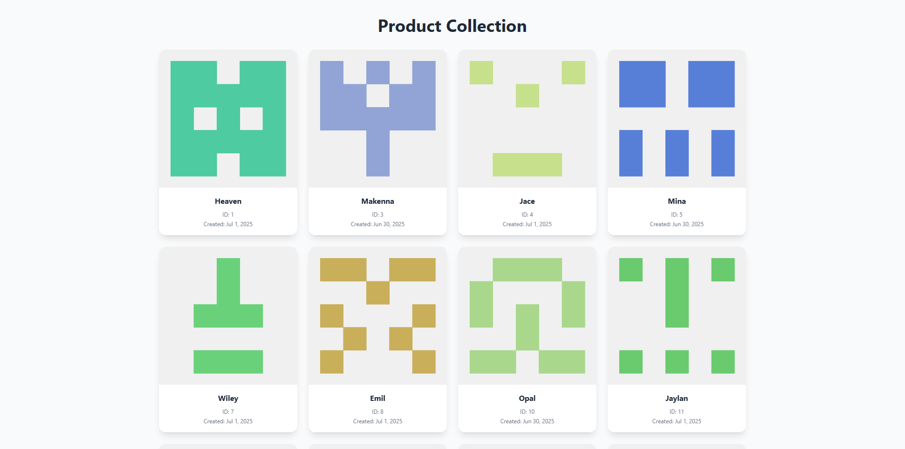
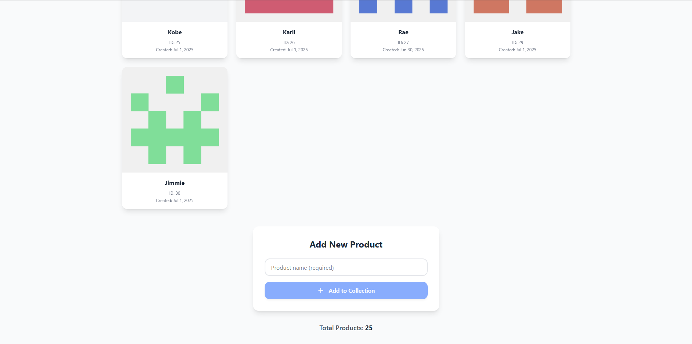

# Card Manager App 🧩

A simple card management web app built using **JavaScript**, **Tailwind CSS**, and **MockAPI.io**. This app allows users to **fetch**, **add**, and **delete** cards dynamically with a clean, animated UI.

## 🔧 Features

- Fetch cards from a mock API
- Add new cards via a Product Name input form (adds to API and UI)
- Delete cards (removes from API and UI)
- UI re-arrangement with smooth transitions
- Styled using Tailwind CSS
- Mock API powered by [MockAPI.io](https://mockapi.io)

---

## 📸 Preview

 <!-- Replace with your actual screenshot file path -->
 <!-- Replace with your actual screenshot file path -->

---

## 🌐 Live Preview

```bash
https://recruiterflow-drab.vercel.app/
```

## 🛠️ Tech Stack

- **HTML + JavaScript**
- **Tailwind CSS**
- **MockAPI.io**
- **Fetch API**

---

## Project Setup & Build Steps

- Create a Vite + React JavaScript Project

```bash
npm create vite@latest
```

- Setup Tailwind CSS

```bash
npm install -D tailwindcss postcss autoprefixer
npx tailwindcss init -p
```

Modify tailwind.config.js

```bash
/** @type {import('tailwindcss').Config} */
export default {
  content: [
    "./index.html",
    "./src/**/*.{js,jsx}"
  ],
  theme: {
    extend: {},
  },
  plugins: [],
}
```

Add Tailwind to src/index.css

```bash
@tailwind base;
@tailwind components;
@tailwind utilities;
```

### 🌐 Setting Up Mock API

1. Go to https://mockapi.io
2. Create a new Project & Resource
   - Project: CardManager
   - Resource: cards
   - Fields:
     - id (auto-generated)
     - createdAt (Faker.js)
     - product (Faker.js)
     - avatar (Faker.js)
3. Copy the generated base API URL

```bash
https://66855303b3f57b06dd4c4802.mockapi.io/products
```

### 🚀 Running the Project

```bash
npm run dev
```

## 🚀 Getting Started

### 1. Clone the repository

```bash
git clone https://github.com/mannyamm21/Recruiterflow
cd assignment
```
